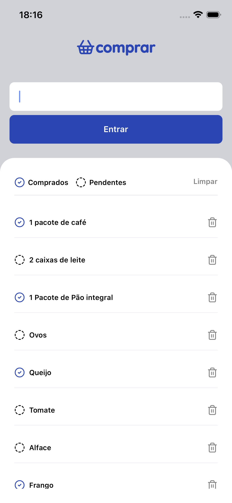

# BaeShop

## Descrição

BaeShop é um aplicativo de lista de compras desenvolvido em React Native, inspirado no curso da formação React Native da Rocketseat. O app permite ao usuário criar e gerenciar uma lista de itens a serem comprados, com visualização de status (pendente ou comprado). Futuras versões incluirão autenticação de usuário e persistência offline.

## ScreenShots

{width=300px}

## Tecnologias Utilizadas

- React Native
- Expo Router
- Expo Go
- Lucide React (ícones)
- TypeScript para tipagem
- FlatList para renderização otimizada

## Instalação

1. Clone o repositório:
   ```
   git clone https://github.com/pauloqueirozz01/baeshopp.git
   ```
2. Navegue até a pasta do projeto:
   ```
   cd baeshop
   ```
3. Instale as dependências:
   ```
   npm install
   ```
4. Rode o app:
   ```
   expo start
   ```

## Como Usar

- Ao abrir o app, você verá uma lista vazia.
- Toque no botão para adicionar um item (ex.: "café").
- O status do item começa como pendente, mas pode ser marcado como comprado.
- Futuras versões incluirão login e sincronização da lista.

## Escolhas Técnicas

- **FlatList**: O FlatList foi escolhido por renderizar os itens de forma eficiente. Ele renderiza lentamente os elementos quando estão prestes a aparecer na tela e remove os itens que saem do campo de visão, economizando memória e tempo de processamento.
- **Componentização**: A interface foi dividida em componentes reutilizáveis, cada um com seu próprio arquivo de estilos, seguindo boas práticas de modularidade.

## Implementações Futuras

- Autenticação de usuário (login, logout)
- Persistência offline usando banco de dados local (para que a lista seja salva mesmo ao fechar o app)
- Sincronização com um backend (para manter as listas entre dispositivos)
- Personalização de categorias de compras
- Melhoria na interface (temas, animações)

## Contribuições

- Sinta-se à vontade para abrir issues ou pull requests.
- Siga o padrão de commits convencional para manter o histórico claro.
